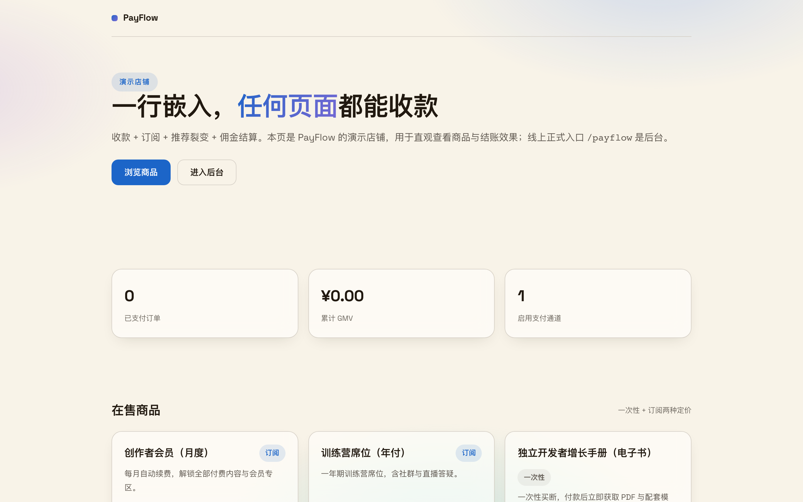
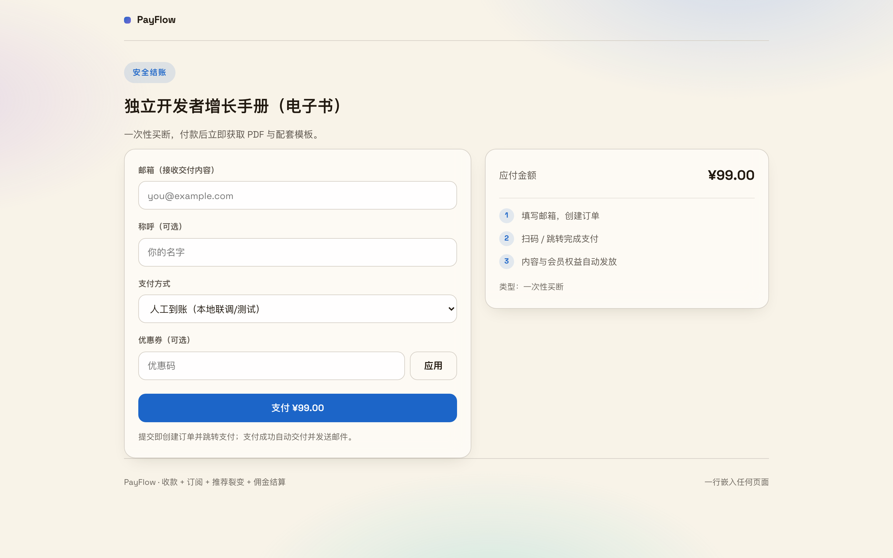
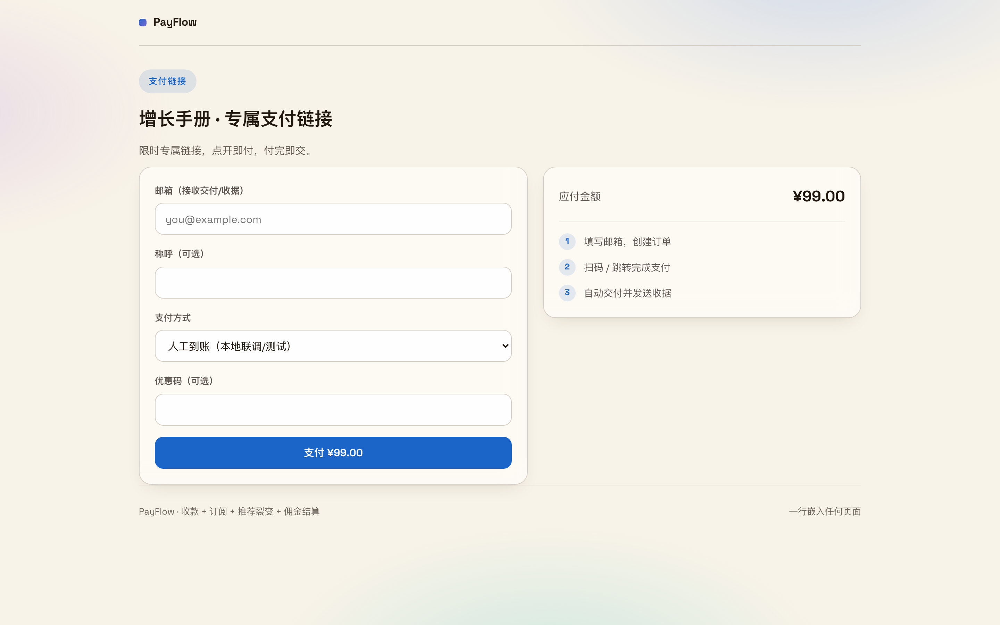
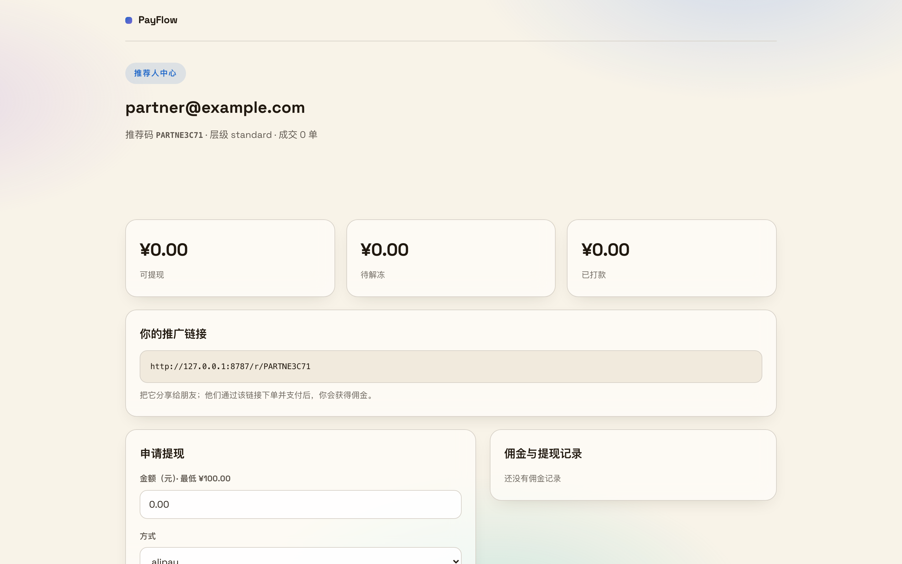
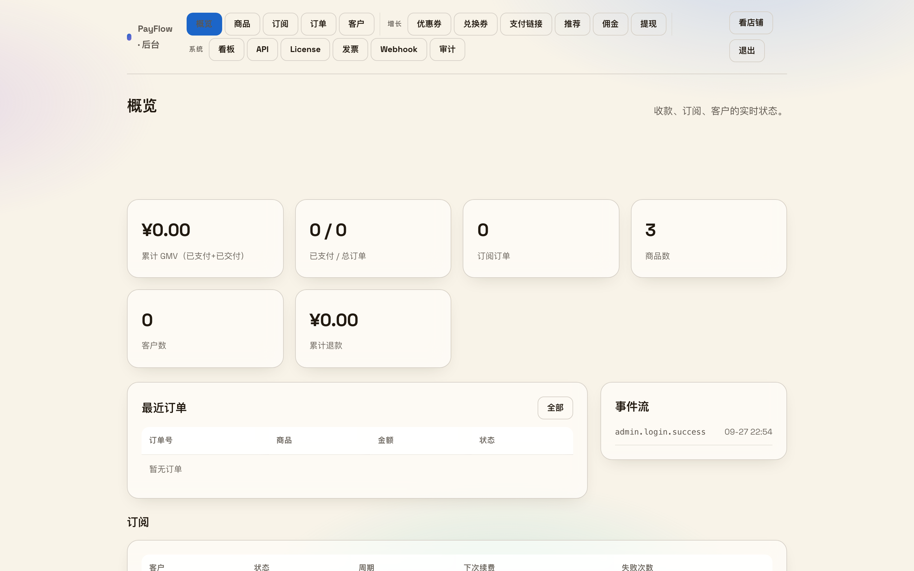

# 附录 · 功能总表（每个模块的截图 · 介绍 · 使用说明）

> 按「收款 → 支付 → 交付 → 核销 → 伙伴分成 → 管理后台」组织，与路由表 `payflow/routes/web.php` 一一对应。
> 每项含：功能介绍（1-2 句，讲用户价值不讲实现）/ 使用说明（怎么开始用）/ 截图。
> 标注 📷 的有真实截图；未标注的为「截图待补」，样式统一不缺位。

PayFlow 只做一件事：让你在任何页面上收钱。整个产品就是一条钱的路径——先把收款入口铺出去（嵌入代码、支付链接、兑换券），买家付款（四种通道），付完自动发货（文件、密钥、发票），老带新的佣金算清楚，最后所有动作汇进一个后台。

---

## 收款：把入口铺出去

收款入口有四种形态，覆盖「有页面」「没页面」「要赠送」「要裂变」四种场景。

#### 演示店铺 `GET /store`

一个最小的店铺示例：商品卡片、GMV 与订单统计、两种定价（一次性 + 订阅）。用来直观看商品和结账长什么样；真实卖货时你可以完全不用这页，直接把嵌入代码贴在自己的页面。

**怎么用**：本地启动后访问 `/store`；点任意商品的「购买」走一笔测试订单，回后台看数据变化。

📷 

#### 嵌入式收银台（一行代码收款） `checkout.js`

PayFlow 的招牌用法：`<script src=".../checkout.js" data-product="prod_xxx">` 贴进任何页面，那个页面就多了一个购买按钮，点开是 PayFlow 托管的结账页。页面不动、数据不迁，收款逻辑全归 PayFlow。

**怎么用**：后台建商品拿到 `prod_xxx` → 把两行代码贴进落地页/CMS/静态站 → 打开页面点购买测试一笔。支持 `data-external-id`、`data-tenant` 把买家与你的用户体系对上。

📷 

#### 专属支付链接 `GET /l/{token}`

不想碰代码？后台点一下生成一条限时支付链接，发微信、发朋友圈，买家点开即付，付完自动发货。适合临时卖货、一对一收款、朋友圈带货。

**怎么用**：后台 → 增长 → 支付链接 → 新建，填金额（或绑定商品）、有效期、限用次数，生成后复制链接直接发。

📷 

#### 兑换券 `GET /redeem`

生成一批兑换码，持码人在兑换页输入即可领取商品——不用付钱。适合赠品、售后补偿、活动福利、直播口令发货。

**怎么用**：后台 → 增长 → 兑换券 → 生成（选商品、数量、有效期），把码发给目标用户；核销记录在列表里可见。

#### 推荐入口 `GET /r/{code}`

推荐链接的落地跳转：买家经推荐链接进店，推荐码自动记录到订单，成交后佣金按归因结算。点击量在后台可见。

**怎么用**：不需要单独配置；给推荐人的链接就是 `/r/推荐码`（见下方「推荐人中心」）。

## 支付：四种通道收款

#### 结账与订单支付 `GET /checkout` · `GET /pay/{token}`

结账页收集买家邮箱与支付方式，创建订单后进入支付页。人工确认通道下，买家看到转账信息，上传/回填凭证，你在后台点「确认」订单生效；在线通道则是跳转扫码，回调自动确认。

**怎么用**：默认人工确认通道零资质即可开卖；支付宝（RSA2）、微信（APIv3）、加密货币通道在后台按 [PAYMENT-CHANNELS.md](PAYMENT-CHANNELS.md) 配置凭证后启用。

#### 支付回跳与订单状态 `GET /return/{token}` · `GET /api/orders/{token}`

买家付完回到的页面：显示订单状态、发货内容与下一步指引。前端页面也可以轮询订单接口自己渲染状态。

**怎么用**：无需配置；支付完成自动跳转。

#### 支付回调 `POST /notify/{alipay,wechat,crypto}`

三个在线通道的异步回调入口：验签、更新订单、触发发货与 Webhook，全部自动。

**怎么用**：把回调地址配进对应支付平台的商户后台即可；回调失败可在后台 Webhook 页重放。

## 交付：付完自动发货

#### 文件交付与签名下载 `GET /d/{token}` · `GET /download/{token}`

订单生效后，买家在交付页拿到文件下载链接。链接带签名、限时、限次，防外传；文件托管在 PayFlow，不用再挂网盘。

**怎么用**：编辑商品 → 资产 → 上传文件；买家付完款在交付页直接下载，下载记录后台可见。

#### License 密钥发放 `GET /admin/licenses`

卖软件授权的场景：订单生效自动发一条 License 密钥，买家复制即用；后台可查每条密钥的状态与归属。

**怎么用**：商品权益类型选 License；对外校验密钥走 `POST /api/v1/licenses/validate`，把校验接进你软件的激活逻辑。

#### 发票 `GET /invoice/{token}`

每笔订单自动生成一张可公开访问的电子收据（签名链接，防篡改），买家付完即得，你可以拿去报销或对账。

**怎么用**：无需配置；订单页与邮件里有发票链接，后台 → 系统 → 发票 可统一检索。

## 核销：优惠券与订单处置

#### 优惠券 `GET /admin/coupons`

满减、折扣、限量、有效期，创建到核销全程后台留痕；对外校验接口 `POST /api/v1/coupons/validate` 供下游系统复用。

**怎么用**：后台 → 增长 → 优惠券 → 新建；买家在结账页输入优惠码即核销，订单记录用了哪张券。

#### 订单处置（确认 / 失败 / 退款） `POST /admin/orders/{id}/{confirm|fail|refund}`

人工确认通道的核心动作：收到转账点「确认」（触发发货与佣金），异常订单标「失败」，售后点「退款」（撤销权益、冲正佣金）。导出 CSV 可直接给财务。

**怎么用**：后台 → 订单 → 筛选/搜索 → 行内操作；所有处置进审计日志。

## 伙伴分成：老带新返佣

#### 推荐人自助页 `GET /partner`

推荐人打开自己的专属链接（后台一键复制发给他）：业绩、可提现金、待解冻佣金、推广链接、提现申请入口都在这一页，全程不用你手工对账。

**怎么用**：后台 → 增长 → 推荐 → 给推荐人建档 → 点「推荐人自助页」复制链接发给他；他申请提现，你在后台审批、线下打款、标记已付。

📷 

#### 推荐归因与佣金台账 `GET /admin/referrals` · `GET /admin/commissions`

每位推荐人的点击、成交、佣金一目了然；佣金先冻结（防退款套利）再按周期解冻，支持冲正；对账单可导出 CSV。

**怎么用**：后台 → 增长 → 推荐 / 佣金；日常只看两页：谁在帮你卖、该给谁打多少钱。

#### 提现审批 `GET /admin/payouts`

推荐人申请的每一笔提现在这里审批：同意（线下打款后标记已付）或驳回，动作全部进事件流与审计。

**怎么用**：后台 → 增长 → 提现；打款方式与最低金额在配置里调整。

## 管理后台

#### 概览 `GET /admin`

GMV、订单、订阅、客户、退款六个核心数字一屏看清，配最近订单与事件流；后台入口即站点根路径，未登录就地显示登录表单。

**怎么用**：访问部署地址即可（线上为 `/payflow`）；右上角分组导航直达全部页面。

📷 

#### 商品（含发卡与资产） `GET /admin/products`

一次性买断与周期订阅两种定价；每个商品可挂多份交付资产（文件、链接、License）与卡密库存（发卡模式：导入卡密，售出自动吐卡）。

**怎么用**：后台 → 商品 → 新建，选类型、定价、权益；卖卡密类商品在「发卡」页批量导入。

#### 订阅 `GET /admin/subscriptions`

全部订阅的周期、下次扣费、失败次数与宽限状态；到期续费单、失败重试（1/3/5 天）、宽限降级由定时任务自动推进，也可手动取消。

**怎么用**：后台 → 订阅；确认服务器 cron 已按 [DEPLOY.md](DEPLOY.md) 配好（每 15 分钟 `php payflow/bin/cron.php`）。

#### 订单与客户 `GET /admin/orders` · `GET /admin/customers`

订单搜索、分页、CSV 导出、行内处置；客户按统一主体（邮箱 / 外部 ID / 租户）归档，点开看名下全部订单与订阅。

**怎么用**：后台 → 订单 / 客户；搜邮箱即可定位一个人的全部交易。

#### 经营看板 `GET /admin/analytics`

GMV 走势、转化、订阅健康（续费率）、渠道来源、API 用量与错误率，经营数字不用另开表格算。

**怎么用**：后台 → 系统 → 看板；对外取数走 `GET /api/v1/analytics/summary`。

#### 开放能力（API / Webhook / 审计） `GET /admin/api-keys` · `GET /admin/webhooks` · `GET /admin/audit`

API Key（Bearer/HMAC）按 Key 限分钟/日配额；Webhook 多目标、HMAC 签名、失败重试与手动重发；全部后台操作入审计日志。

**怎么用**：后台 → 系统 → API 新建 Key；Webhook 页填回调地址并按 [EVENTS.md](EVENTS.md) 订阅事件；审计页查「谁在什么时候做了什么」。

#### 定时任务 `POST /admin/cron/run`

订阅续费与提醒、佣金解冻、Webhook 重试、用量清理都挂在 cron 上；后台可手动触发一次，验证整条流水线通不通。

**怎么用**：生产按 [DEPLOY.md](DEPLOY.md) 配 cron；本地调试直接在后台点「运行」。

---

截图持续补全中。
